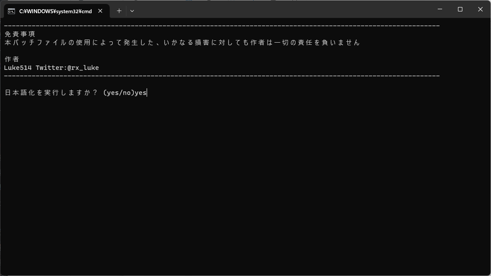
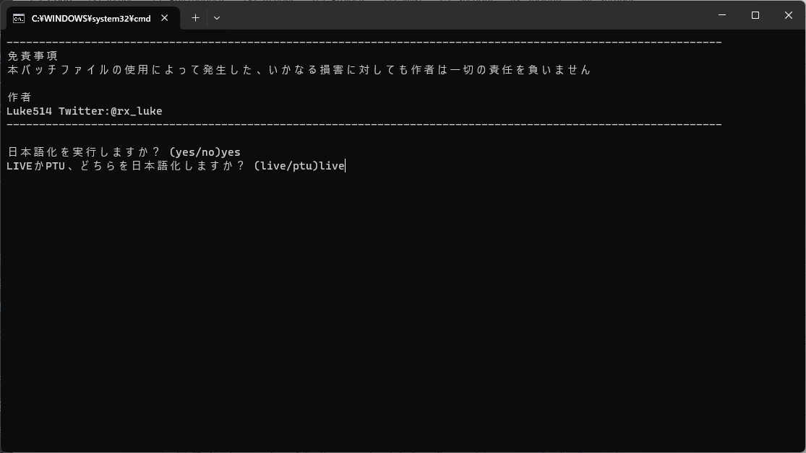
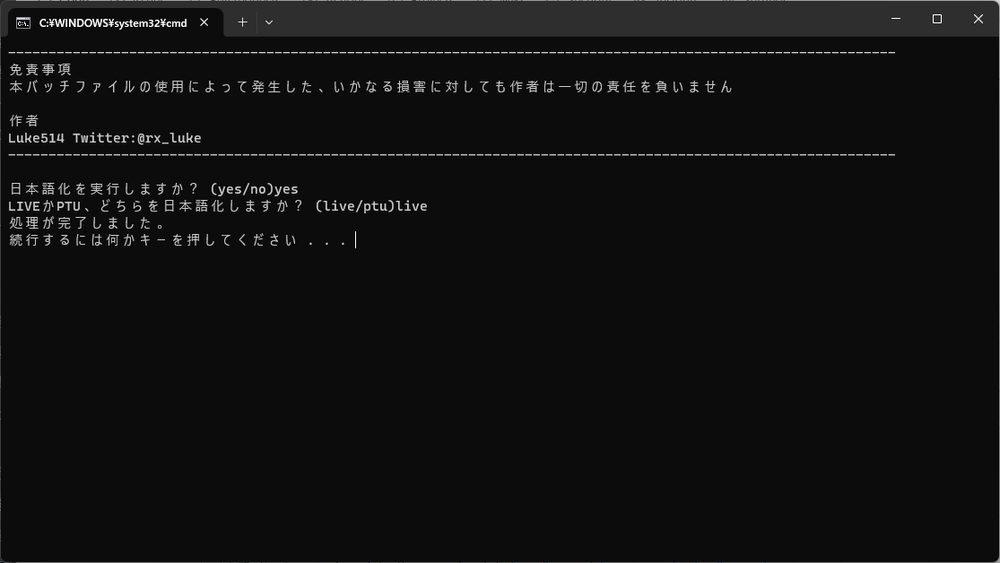

# これは何をするためのもの？
スターシチズンを日本語化するglobal.iniやuser.cfgをどこに置いていいか分からないという方でも  
簡単に日本語化できるようにするバッチファイルです。  
  
# 使い方
1.&nbsp;バッチファイル(StarCitizen_JP_Translation_Installer.bat)をダウンロードします。  
&emsp;(oldは以前のバージョンです　現行バージョンで問題が発生した際にご利用ください)  
  
2.&nbsp;任意の場所でバッチファイルを起動後、日本語化するかどうか聞かれるので、YESかNOを入力してください。  
&emsp;(y、nでも可)  
  
  
3.&nbsp;LIVEかPTU、どちらを日本語化したいか聞かれるので、利用しているバージョンを入力してください。  
&emsp;(l、pでも可　通常はLIVEでOKです)  
  
  
4.&nbsp;「処理が完了しました。」と出力されていれば、日本語化が完了しているはずですので、ゲームを起動してみてください。  
  
  
# よくある質問
Q.&nbsp;自分で配置したuser.cfgがある場合はどうなりますか？  
A.&nbsp;user.cfgが配置されている場合は日本語化に必要な情報を追記します。  
&emsp;(既に必要な情報が記載されていれば何もしません)  
  
Q.&nbsp;global.ini(翻訳ファイル)を更新したい。  
A.&nbsp;通常通りにバッチファイルを実行すると、最新版のglobal.iniを取得し、更新します。  
  
Q.&nbsp;日本語化を解除したい  
A.&nbsp;StarCitizen_JP_Translation_Remover.batをお使いください(操作方法はほぼ同じです)  
  
# 免責事項
本バッチファイルの使用によって発生した、いかなる損害に対しても作者は一切の責任を負いません。  
Star Citizen®、Roberts Space Industries®、Cloud Imperium®はCloud Imperium Rights LLCの登録商標です。  
  
# 作者
Luke514  
Twitter:@rx_luke  
Star Citizen紹介コード(referral code) → 【STAR-9YPT-ZV5J】 
