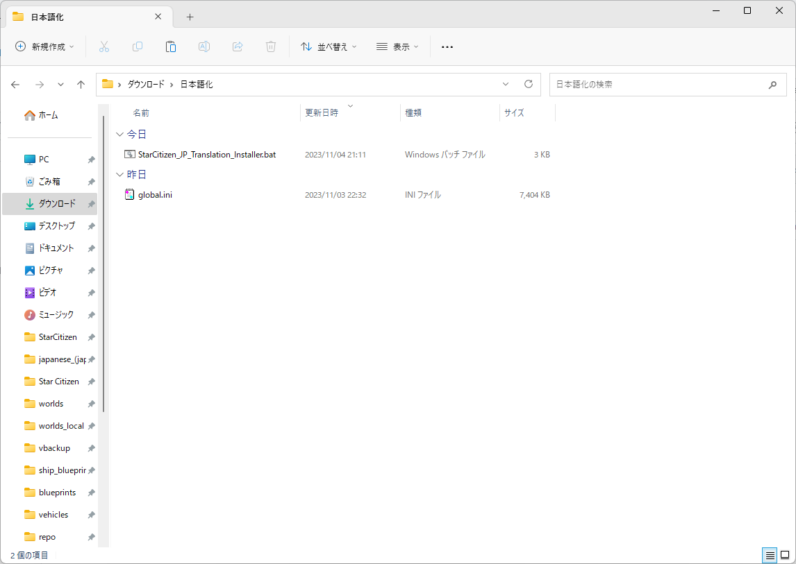

# これは何をするためのもの？
スターシチズンを日本語化するglobal.iniやuser.cfgをどこに置いていいか分からないという方でも  
簡単に日本語化できるようにするバッチファイルです  
  
# 使い方
1.&nbsp;バッチファイルをダウンロードします  
&emsp;(oldは以前のバージョンです　現行バージョンで問題が発生した際にご利用ください)  
  
2.&nbsp;任意の場所にglobal.ini(翻訳ファイル)と共に配置します   
&emsp;(global.iniのダウンロード => https://github.com/stdblue/StarCitizenJapaneseResources/releases)  
  
  
3.&nbsp;バッチファイルを起動後、日本語化するかどうか聞かれるので、YESかNOを入力してください(y、nでも可)  
  
  
4.&nbsp;LIVEかPTU、どちらを日本語化したいか聞かれるので、LIVEかPTUを入力してください(l、pでも可)  
  
  
5.&nbsp;「処理が完了しました。」と出力されていれば、日本語化が完了しているはずですので、ゲームを起動してみてください。  
  
  
# 免責事項
本バッチファイルの使用によって発生した、いかなる損害に対しても作者は一切の責任を負いません  
Star Citizen®、Roberts Space Industries®、Cloud Imperium®はCloud Imperium Rights LLCの登録商標です。  
  
Use this batch file at your own risk.  
Star Citizen®, Roberts Space Industries® and Cloud Imperium® are registered trademarks of Cloud Imperium Rights LLC.  
  
# 作者
Luke514  
Twitter:@rx_luke  
Star Citizen紹介コード(referral code) → 【STAR-9YPT-ZV5J】 
